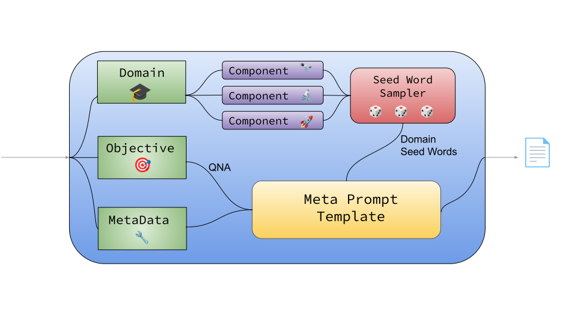
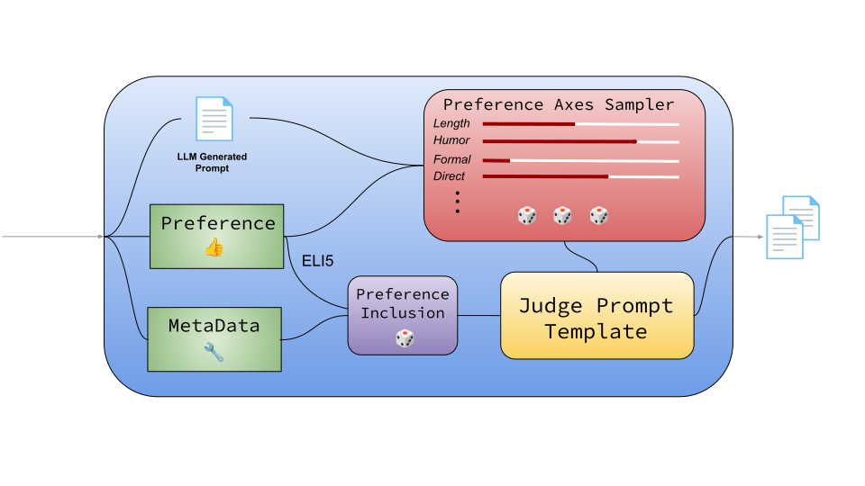

**High-Level Design and Architecture of AIF-GEN**

1. User configures a series of `Alignment Tasks` through `YAML` files which encapsulate an evolving RLHF specification: *objective* (e.g. QNA), *preference* (e.g. Answer shortly and ELI5), *domain* (e.g. education, math topics), *metadata* (e.g. sample count, model temperature)

1. The `Prompt Mapper` generates a *meta-prompt* using each `Alignment Task` specification

1. This *meta-prompt* generates sample prompts using the LLM inference engine.

1. The sample prompts are passed through the LLM inference engine, producing two candidate responses.

1. The `Alignment Task` preference and `Response Mapper` combine the candidate responses to produce a *judge prompt*

1. The inference engine labels the *chosen* and *rejected* responses among the candidates, completing the preference sample.

1. Users can optionally validate the datasets and apply auxiliary transforms.

1. The samples are aggregated within and across *Alignment Tasks* and optionally uploaded to HuggingFace via our CLI.

### Prompt Mapper

The user-configured domain is broken down into *components* that map to seed word vocabularies to be injected into the prompt. The seed words for each component are randomly sub-sampled and combined with the task objective in the *Meta Prompt Template*. Optional *MetaData* enables custom prefixes or suffixes in the final *Meta Prompt* output.

### Response Mapper

An LLM-generated prompt is given as input along with the user-defined task preference. Various auxiliary styles are sampled via the *preference axes sampler* to promote diversityin LLM responses. The task preference is randomly included or rejected from the judge prompt template to facilitate ranking between downstream response pairs. This process is performed twice to produce two unique *Judge Prompts*, which ultimately yield a chosen or rejected sample. Optional *MetaData* enables scaling the preference inclusion logic to increase similarity between responses, making the preferred response more subtle.
